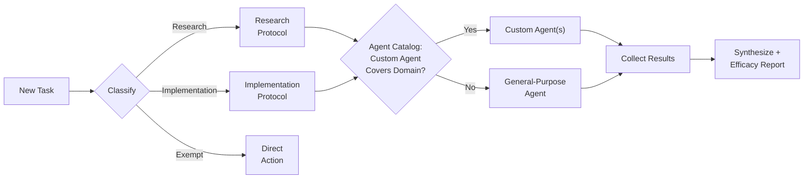
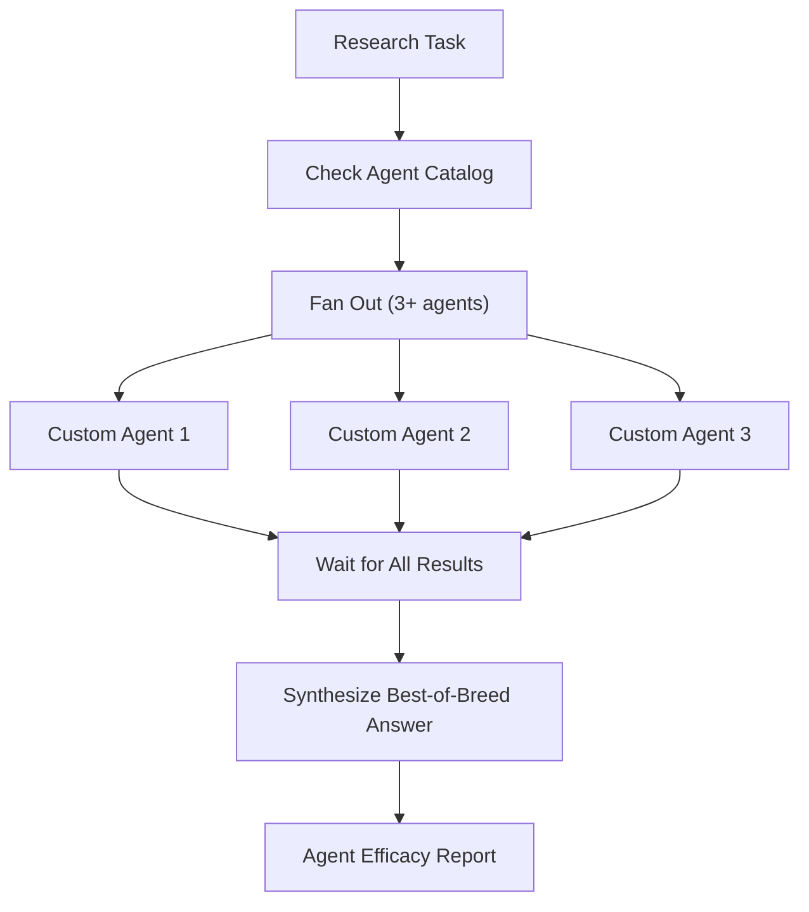
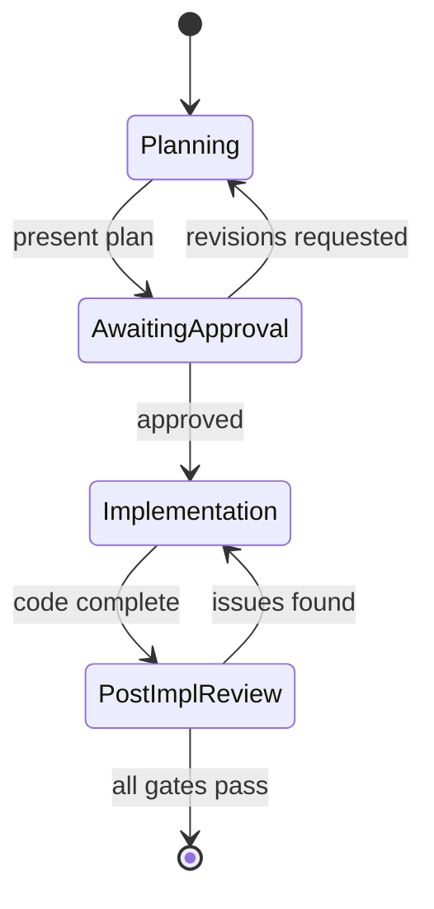
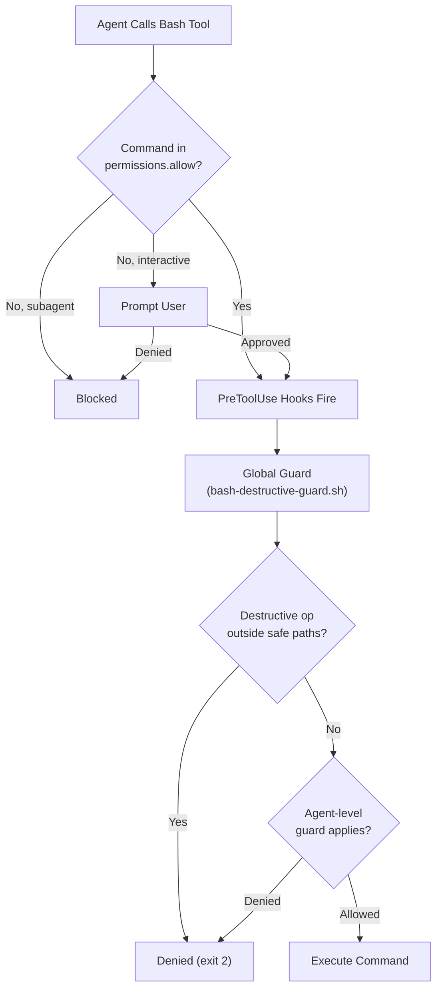
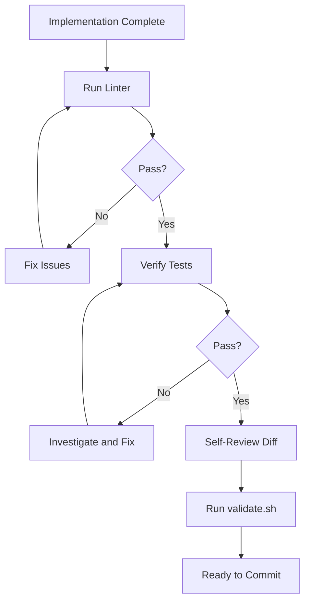

# Agent Framework

Personal AI coding assistant configuration — agents, rules, and settings — managed as a git repo and symlinked into `~/.claude/` for use across all projects and machines. Claude Code only.

## Contents

- [Purpose](#purpose)
- [Security Advisory — Expertise Pipeline Removal](#security-advisory--expertise-pipeline-removal)
- [Repository Structure](#repository-structure)
- [Quick Start](#quick-start)
- [How It Works](#how-it-works)
- [Workflows](#workflows)
- [Current Agents](#current-agents)
- [Current Rules](#current-rules)
- [Current Commands](#current-commands)
- [Current Skills](#current-skills)
- [Installation](#installation)
- [Adding New Rules](#adding-new-rules)
- [Adding New Agents](#adding-new-agents)
- [Modifying Settings](#modifying-settings)
- [Keeping Machines in Sync](#keeping-machines-in-sync)
- [What Does NOT Belong in This Repo](#what-does-not-belong-in-this-repo)
- [Precedence Order](#precedence-order)

## Purpose

This repo is the single source of truth for user-level Claude Code customization. It exists so that every new Claude Code instance — on any machine, in any project — inherits the same agents, behavioral rules, and settings.

The architecture is **monolithic**: domain expertise lives directly in each `agents/<name>.md` file (frontmatter plus full expertise inline). There are no separate skill files, wrappers, or secondary platform artifacts. Setup symlinks the repo into `~/.claude/`. The framework has three layers: rules govern behavior, commands (slash commands) codify named multi-agent workflows, and agents provide domain expertise.

## Security Advisory — Expertise Pipeline Removal

This framework previously included an automated **expertise pipeline** that injected externally-stored knowledge into the AI assistant's system context on every prompt submission. That pipeline has been **removed**.

### What was removed

- A `UserPromptSubmit` hook that called an external API on every prompt and emitted the response as `systemMessage`
- The API write-gateway agent
- The shared surfacing module and the multi-hop write path that auto-routed candidate blocks from subagents into the store
- The read-only query agent (the API query interface)
- The repo-local offline queue, the offline-flush script, and the benchmark harness

### Why

The hook injected content from an external API endpoint into the harness **system role** with no signing, provenance, or user review. Claude Code treats `systemMessage` from a `UserPromptSubmit` hook as harness-level instruction — equivalent privilege to `CLAUDE.md` and loaded rules. A compromised endpoint could dictate session behavior with the full blast radius of the session's tool allowlist. This is structurally identical to the MCP-server threat the project rejects in [`rules/no-mcp-servers.md`](rules/no-mcp-servers.md) (OWASP ASI04, citing CVE-2025-59536 and CVE-2026-21852).

A multi-hop write path (subagent → candidate block → curator → store → next-session preflight) closed a self-poisoning loop with no human review at any stage. The default URL was hardcoded in both `settings.json` and the script, making the threat live by default for any user who ran `setup.sh`.

[ADR-046](adrs/046-expertise-injection-removal.md) records the full threat model. The `no-mcp-servers` policy has been extended to explicitly cover network-sourced `systemMessage` injection from any runtime mechanism, not just MCP as a protocol.

### What's next

A future, safer mechanism for sharing lessons-learned across sessions is being designed separately. Candidate approaches include signed local snapshots, signature verification with allowlisted public keys, and tool-call retrieval where the agent makes the request as a visible tool invocation rather than a silent hook. The previously-stored expertise data has been backed up; once the new design lands, that data can be reviewed and re-fed into it.

## Repository Structure

```text
agent-framework-claude/
├── README.md              # You are here
├── AGENTS.md              # Agent catalog — routing source of truth
├── CLAUDE.md              # Claude Code-specific configuration (thin, points to AGENTS.md)
├── CONTRIBUTING.md        # Agent authoring guidelines
├── SECURITY.md            # Vulnerability disclosure policy (ADR-081)
├── .gitignore             # Prevents secrets from being committed
├── .markdownlint-cli2.jsonc # markdownlint config — house-style rule tuning
├── .yamllint.yaml         # yamllint config — workflow-file tuning
├── .review/               # Artifact handoff channel — tracked, never merges to dev (ADR-064)
├── setup.sh               # Automated setup — symlinks into ~/.claude/
├── validate.sh            # Pre-push consistency checker
├── settings.json          # Claude Code user-level settings
├── standards/             # Team-wide technology and tooling standards
│   ├── documentation.md   # Markdown formatting, README, and CLAUDE.md conventions
│   └── tooling.md         # Primary languages, frameworks, platforms, and tools
├── docs/                  # Supplementary documentation
│   ├── framework-comparison.md       # Comparison of agent-framework approaches
│   └── multi-account-git-identity.md # Three-layer identity model for multi-account hosts
├── adrs/                  # Architecture Decision Records (MADR format)
├── scripts/               # Utility scripts
│   ├── lib/               # Shared sourced shell helpers (bash-3.2 safe; ADR-061)
│   │   ├── log.sh                # Output helpers + fatal/print_summary; --self-test
│   │   └── git.sh                # git_repo_root; --self-test
│   ├── check-bash32.sh    # Runs 3.2-targeted scripts under a real bash 3.2 binary (ADR-083)
│   ├── check-pin-drift.sh # Detects stale workflow-embedded container digest pins (#15)
│   ├── rulesets.sh        # Ruleset-as-code: --check/--apply/--pull vs rulesets/*.json (ADR-086)
│   ├── scaffold.sh        # Scaffolds new agent or rule from templates
│   ├── setup-repo.sh      # Repo initialization helper
│   ├── regen-agent-catalog.sh  # Agent catalog drift gate (--check) + routing-mirror regen (--write); ADR-062
│   └── wim/               # Frozen work-item creation suite (SHA-pinned; see ADR-050)
│       ├── _lib.sh                # Shared helpers — backend dispatch, ID capture, helpers
│       ├── apply-manifest.sh      # Driver — walks manifest tree, threads parent IDs
│       ├── create-epic.sh         # Frozen Epic creator (ADO + GitHub backends)
│       ├── create-feature.sh      # Frozen Feature creator (with --parent-id)
│       ├── create-issue.sh        # Frozen standalone-issue creator (no parent, no type/* label)
│       ├── create-user-story.sh   # Frozen User Story creator (with --parent-id, AC field)
│       ├── manifest.example.json  # Working example manifest
│       ├── manifest.schema.json   # JSON Schema (Draft-07) for the manifest
│       └── .frozen-shas           # SHA-256 pins, verified by validate.sh
├── templates/             # Scaffolding templates
│   ├── agent/             # Monolithic agent template
│   └── rule/              # rule.md template
├── rulesets/              # Committed branch-protection ruleset state (ADR-086)
│   ├── protect-dev.json           # Desired state for the dev ruleset (normalized)
│   ├── protect-main.json          # Desired state for the main ruleset (normalized)
│   └── README.md                  # Normalization contract + workflow
├── tests/                 # Test suites for project tooling (each suite: run-tests.sh, exit 0 PASS / 1 FAIL)
│   ├── fixtures/bin/gh    # Deterministic gh shim shared by the identity-guard suites (ADR-083)
│   ├── bash-destructive-guard/    # hooks/bash-destructive-guard.sh — compound/wrapper/find/safe-path cases
│   ├── expertise-search/          # skills/expertise/scripts/expertise-search.sh — helper contract (ADR-094)
│   ├── fanout-nudge/              # hooks/fanout-nudge.sh — PostToolBatch advisory contract (ADR-090)
│   ├── gh-identity-guard/         # hooks/gh-identity-guard.sh — pre-push identity ladder (ADR-054)
│   ├── instructions-loaded-log/  # hooks/instructions-loaded-log.sh — InstructionsLoaded logger (ADR-092)
│   ├── rulesets/          # scripts/rulesets.sh — normalization + apply-rail fixtures (ADR-086)
│   ├── secrets-guard/     # hooks/secrets-guard.sh — staged-blob bypass tests (ADR-059)
│   ├── session-gh-identity-guard/ # hooks/session-gh-identity-guard.sh — PreToolUse JSON contract
│   ├── session-secrets-guard/     # hooks/session-secrets-guard.sh — PreToolUse JSON contract (ADR-053)
│   ├── setup-claude-cli/  # setup.sh setup_claude_cli() — CLI install section (ADR-093)
│   ├── subagent-verdict-guard/    # hooks/subagent-verdict-guard.sh — SubagentStop verdict contract (ADR-088)
│   ├── validate/          # Clone-and-mutate regression harness for validate.sh (bash 4+; ADR-083)
│   ├── wim/               # End-to-end tests for scripts/wim/ (stateful az/gh CLI shims)
│   └── worktree-guard/    # hooks/worktree-create.sh — symlink containment (ADR-070)
├── agents/                # Monolithic Claude Code agents (frontmatter + full expertise inline)
│   ├── ansible-expert.md
│   ├── aws-expert.md
│   ├── aws-msk-expert.md
│   ├── azure-devops-expert.md
│   ├── azure-infra-expert.md
│   ├── cilium-expert.md
│   ├── code-review-expert.md
│   ├── docker-expert.md
│   ├── docs-expert.md
│   ├── dotnet-expert.md
│   ├── gh-cli-expert.md
│   ├── gitflow-expert.md
│   ├── grafana-expert.md
│   ├── helm-expert.md
│   ├── hyperv-expert.md
│   ├── kafka-developer-expert.md
│   ├── kafka-self-managed-expert.md
│   ├── lgtm-backends-expert.md
│   ├── linter.md
│   ├── longhorn-expert.md
│   ├── proxmox-expert.md
│   ├── security-review-expert.md
│   ├── shell-expert.md
│   ├── talos-expert.md
│   ├── tauri-expert.md
│   ├── terraform-expert.md
│   ├── tetragon-expert.md
│   ├── vcluster-expert.md
│   ├── work-item-management-expert.md
│   └── wsl2-expert.md
├── commands/              # Claude Code slash commands (symlinked to ~/.claude/commands/)
│   └── review.md          # /review — 3-way parallel review (code + security + linter)
├── skills/                # Claude Code skills with bundled files (symlinked to ~/.claude/skills/)
│   └── expertise/         # /expertise — read-only agent-expertise-api search (ADR-094)
│       ├── SKILL.md               # Skill body — steps + constraints
│       └── scripts/expertise-search.sh  # Bundled helper — token-safe curl wrapper
├── hooks/                 # Shell scripts for Claude Code and git hooks
│   ├── bash-destructive-guard.sh
│   ├── fanout-nudge.sh
│   ├── gh-identity-guard.sh
│   ├── instructions-loaded-log.sh
│   ├── secrets-guard.sh
│   ├── session-gh-identity-guard.sh
│   ├── session-secrets-guard.sh
│   ├── stop-preflight-check.sh
│   ├── subagent-verdict-guard.sh
│   ├── worktree-create.sh
│   └── worktree-remove.sh
├── rules/                 # Claude Code user-level behavioral rules
│   ├── adr-required.md
│   ├── agent-first-selection.md
│   ├── artifact-handoff.md
│   ├── consensus-by-replication.md
│   ├── conventional-commits.md
│   ├── debian-baseline.md
│   ├── documentation-in-plan.md
│   ├── file-issues-first.md
│   ├── gh-identity-guard.md
│   ├── github-flow.md
│   ├── no-mcp-servers.md
│   ├── orchestrator-protocol.md
│   ├── plan-before-code.md
│   ├── post-implementation-review.md
│   ├── pr-template-standard.md
│   ├── research-parallelism.md
│   ├── script-output-conventions.md
│   ├── secrets-guard.md
│   ├── semver-tagging.md
│   └── structured-review-format.md
└── web/                   # Single-file distillate for Claude Code Web / Claude.ai
    └── instructions.md    # Curated web-surface guidance — orchestration, conventions, security
```

## Quick Start

```bash
# 1. Clone the repo
git clone git@github.com:<your-account>/agent-framework.git ~/.agent-framework

# 2. Run setup (creates symlinks, backs up existing files, and offers to
#    install the Claude Code CLI if it is not already present)
~/.agent-framework/setup.sh
```

That's it. The setup script handles everything — see [Installation](#installation) for details. On a bare host, install `git` first (Debian 13: `sudo apt install -y git`; macOS: `xcode-select --install`).

## How It Works

### Settings

`settings.json` is symlinked to `~/.claude/settings.json`. Controls model defaults, performance tuning, hooks, and permissions across all projects.

**Current configuration:**

```json
{
  "effortLevel": "high",
  "env": {
    "CLAUDE_CODE_SUBAGENT_MODEL": "sonnet",
    "MAX_THINKING_TOKENS": "32000",
    "BASH_DEFAULT_TIMEOUT_MS": "120000",
    "BASH_MAX_TIMEOUT_MS": "600000"
  }
}
```

| Setting | Value | Purpose |
|---|---|---|
| `effortLevel` | `high` | Deep thinking on every task |
| `CLAUDE_CODE_SUBAGENT_MODEL` | `sonnet` | Subagents use Sonnet — balances speed and quality for parallel research |
| `MAX_THINKING_TOKENS` | `32000` | Extended thinking budget for deeper reasoning |
| `BASH_DEFAULT_TIMEOUT_MS` | `120000` (2 min) | Default timeout for bash commands |
| `BASH_MAX_TIMEOUT_MS` | `600000` (10 min) | Max timeout for long-running commands (builds, tests) |

**Other available settings:**

| Setting | Type | Purpose |
|---|---|---|
| `CLAUDE_AUTOCOMPACT_PCT_OVERRIDE` | env var | Trigger context compaction earlier (default ~95%, lower = more aggressive) |
| `CLAUDE_CODE_MAX_OUTPUT_TOKENS` | env var | Cap output tokens per request |
| `BASH_MAX_OUTPUT_LENGTH` | env var | Max chars in bash output before truncation |

### Rules

Rules govern AI assistant behavior. Each behavioral convention is a single file in `rules/<name>.md`, loaded automatically at session start.

**Claude Code rules** use YAML frontmatter:

```markdown
---
description: 'Short description used to decide when the rule is relevant'
paths: "*.py"              # Optional — scope the rule to specific file patterns
---

Rule content here.
```

- Rules without a `paths` field apply universally.
- Rules with a `paths` field only activate when working with matching files.
- Project-level rules (`.claude/rules/`) take precedence over user-level rules on conflict.

### Agents

Each agent is a single `agents/<name>.md` file with YAML frontmatter and the full domain expertise inlined in the body. There are no separate skill files or wrapper layers.

```markdown
---
name: agent-name
description: What this agent does
model: opus                # Optional — default model for this agent
tools: Read, Grep, Glob    # Optional — restrict available tools
---

Full agent system prompt with all domain knowledge here.
```

Agents named `*-expert` are read-only advisors — they research, explain, and recommend but never write files. `linter` is an execution provider that discovers files, runs linters, and applies auto-fixes.

Agents can be invoked via the `--agent` flag, the Agent tool, or `@name` in sessions.

**Claude Code frontmatter fields:**

| Key | Description | Values |
|---|---|---|
| `model` | Model override | `opus`, `sonnet`, `haiku`, full model ID |
| `maxTurns` | Max agentic turns | integer |
| `isolation` | Git worktree isolation | `worktree` |
| `effort` | Effort level override | `low`, `medium`, `high` |
| `background` | Always run as background task | `true` |

### Web Surface (`web/`)

**Claude Code Web** (`code.claude.com`, `claude.ai/code`) and **Claude.ai chat** do not auto-load `CLAUDE.md`, `AGENTS.md`, or `rules/*.md` the way the local CLI does. The framework's web surface is a single curated distillate at `web/instructions.md`, designed to be pasted into:

- **Claude.ai** — `Project Instructions` (Settings inside a Project) for repo-scoped use, or `Profile Instructions` (Settings → Profile) for account-wide use.
- **Claude Code Web** — committed as `CLAUDE.md` or under the project's instructions surface.

It captures the orchestrator protocol, agent-first selection, research parallelism, plan-before-code, Conventional Commits / SemVer / GitHub Flow, security policies, and review gates — the same conventions enforced by the local rules, condensed for web context budgets and noting where local automation (`validate.sh`, hooks) has no harness equivalent on the web.

See [`web/instructions.md`](web/instructions.md) and [ADR-048](adrs/048-claude-code-web-distillate.md).

### Hooks

Hooks are shell scripts that run in response to Claude Code session events, providing automated pre-flight checks and security guards. Claude Code supports 26 hook events; all events support actionable output.

| Hook | Event | Purpose |
| --- | --- | --- |
| `bash-destructive-guard.sh` | `PreToolUse` | Denies `rm`/`mv` commands targeting paths outside a configurable safe list |
| `session-secrets-guard.sh` | `PreToolUse` | Denies agent writes or echos of secrets before they reach disk |
| `session-gh-identity-guard.sh` | `PreToolUse` | Denies mutating `gh`/`git push` ops when the active GitHub identity is wrong |
| `gh-identity-guard.sh` | git `pre-push` | Blocks pushes from the wrong GitHub account (raw terminal/IDE vector) |
| `stop-preflight-check.sh` | `Stop` | Runs a description prompt before the session ends |
| `subagent-verdict-guard.sh` | `SubagentStop` | Blocks a framework custom agent returning without its verdict line (ADR-088) |
| `fanout-nudge.sh` | `PostToolBatch` | Advisory-only nudge toward the 3+ divergence minimum; never blocks (ADR-090) |
| `instructions-loaded-log.sh` | `InstructionsLoaded` | Local metadata-only logger of rule/CLAUDE.md loads; observability-only, never blocks (ADR-092) |
| `worktree-create.sh` | `PostToolUse` | Enforces symlink containment on worktree creation (ADR-070) |
| `worktree-remove.sh` | `PostToolUse` | Cleans up worktrees after removal |

The `bash-destructive-guard.sh` hook is a global guard that denies `rm` and `mv` commands targeting paths outside a configurable safe list (`~/.claude/bash-guard-safe-paths.conf`). It works alongside the `Bash(rm:*)` and `Bash(mv:*)` permission entries — the allow list prevents silent subagent denial, while the hook provides defense-in-depth across all agents. Relative paths within the current project and `/tmp` are always allowed. The command is split into segments (on `&&`, `||`, `|`, `;`, and newline) and a canonical verb is resolved past wrapper commands (`env`/`sudo`/`xargs`/`nice`/…), so `env rm`, a newline-separated `rm`, `find -delete`/`-exec rm`, and shell-interpreter `-c` are all caught; `git rm`/`grep rm` are not flagged. See [Permission Evaluation](#permission-evaluation) for the full flow.

The `session-secrets-guard.sh` hook is the in-session (layer 2) counterpart to the `secrets-guard.sh` pre-commit hook (layer 1). It fires on `Bash`, `Write`, `Edit`, `MultiEdit`, and `NotebookEdit` tool calls and denies any that would surface a secret — an inline secret literal or credential-file read in a Bash command, or a secret written/edited into a file — before it reaches disk. Same pattern set and `SKIP_SECRETS_GUARD=1` / `.secrets-guard-allowlist` overrides as the git hook. See ADR-053.

The `session-gh-identity-guard.sh` (`PreToolUse`) and `gh-identity-guard.sh` (git `pre-push`) hooks are a two-layer, fail-closed guard against pushing or mutating GitHub from the wrong account on a multi-account host. The in-session hook denies a mutating `gh`/`git push` call when the active identity is wrong (a cheap pre-check means only mutating ops are probed); the git pre-push hook closes the raw-terminal/IDE vector. The signal is hybrid — a local-only (gitignored) `.gh-expected-identity` pin (strict login match) when present, else repo accessibility. Overrides: `GH_IDENTITY_OVERRIDE=<login>` (env var only; ADR-070), `.gh-identity-allowlist`, `SKIP_GH_IDENTITY_GUARD=1`. See `rules/gh-identity-guard.md` and ADR-054.

Hooks are configured in `settings.json`. Restart Claude Code after any hook configuration changes.

## Workflows

The orchestrator protocol and research parallelism define how the AI assistant operates. These diagrams illustrate the key communication paths and decision points.

### Task Classification and Agent Routing

Every task is classified before work begins. The orchestrator checks the full agent catalog and routes to custom agents before falling back to general-purpose agents.



Agent tiers in the catalog:

| Tier | Role | Examples |
| --- | --- | --- |
| Domain Specialist | Read-only advisory | `shell-expert`, `docs-expert`, `gh-cli-expert` |
| Execution Provider | Writes files, may delegate | `linter` |

### Research Parallelism

Research tasks fan out to a minimum of 3 agents in parallel. The orchestrator waits for all agents to return before synthesizing.



### Planning, Implementation, and Review Lifecycle

Code changes follow a strict lifecycle: plan, get approval, implement, review. Revision loops exist at approval and review stages.



### Permission Evaluation

A call proceeds only when the permission layer does not block it and all PreToolUse hooks return allow. The two layers operate independently: the allow list controls the approval dialog; hooks control actual execution.



Safe paths are configured in `~/.claude/bash-guard-safe-paths.conf` (one absolute path prefix per line). `/tmp` and relative paths within the current project are always allowed. Paths containing `..` segments are always denied.

### Post-Implementation Review

After substantive implementation work, a review pass runs before committing. Each gate must pass before proceeding. The `validate.sh` step applies when changes touch agents, rules, or commands.



## Current Agents

| Agent | Model | Tier | Description |
|-------|-------|------|-------------|
| `ansible-expert` | opus | Domain Specialist | Ansible guidance. Playbook authoring, variable precedence, collection architecture, vault, CI/CD. |
| `aws-expert` | opus | Domain Specialist | AWS guidance. IAM/IRSA/SCPs, S3, VPC, Route 53, EKS, ECS/Fargate, ECR, Elastic Beanstalk, MSK. |
| `aws-msk-expert` | opus | Domain Specialist | Amazon MSK guidance. Provisioned vs Serverless, broker sizing, authentication (IAM, SASL/SCRAM, mTLS), MSK Connect, MSK Replicator, monitoring. |
| `azure-devops-expert` | opus | Domain Specialist | Azure DevOps guidance. Pipelines, repos, boards, work items, REST API, az devops CLI. |
| `azure-infra-expert` | opus | Domain Specialist | Azure infrastructure guidance. Entra ID, Key Vault, SignalR, Storage, Private Endpoints, ExpressRoute, Log Analytics. |
| `cilium-expert` | opus | Domain Specialist | Cilium CNI guidance. Install/upgrades, IPAM, datapath modes, network policy, LB-IPAM/BGP, ClusterMesh, Hubble, encryption, Gateway API, Talos integration. |
| `code-review-expert` | opus | Domain Specialist | Semantic code review. Logic errors, design quality, security concerns, requirement fidelity. |
| `docker-expert` | opus | Domain Specialist | Docker guidance. Dockerfiles, BuildKit, multi-stage, multi-platform, Compose v2, security. |
| `docs-expert` | opus | Domain Specialist | Documentation guidance. Best practices, content style, curation, Mermaid diagrams. |
| `dotnet-expert` | opus | Domain Specialist | .NET guidance. .NET 10 LTS, ASP.NET Core, EF Core, worker services, cross-platform builds. |
| `gh-cli-expert` | opus | Domain Specialist | GitHub CLI guidance. Consults `gh --help` dynamically. Read-only by default. |
| `gitflow-expert` | opus | Domain Specialist | Git workflow guidance. Examines repo state, provides context-aware recommendations. |
| `grafana-expert` | opus | Domain Specialist | Grafana guidance. Provisioning as code, unified alerting, dashboards, LGTM datasource/correlation config, auth, security, deployment. |
| `helm-expert` | opus | Domain Specialist | Helm guidance. Chart authoring, values merge, hooks, template debugging, release workflows. |
| `hyperv-expert` | opus | Domain Specialist | Hyper-V guidance. Hypervisor architecture, VM generations, VHDX, switches, nested virt, WSL2, WHPX, VBS/HVCI. |
| `kafka-developer-expert` | opus | Domain Specialist | Kafka developer guidance. Producer/consumer for Kafka 4.x, delivery semantics, idempotence/transactions, consumer-group and rebalance behavior, topic/partition design. |
| `kafka-self-managed-expert` | opus | Domain Specialist | Self-managed Kafka guidance. Kafka 4.x on Kubernetes, Strimzi, KRaft, storage, HA, cluster administration, encryption/authentication. |
| `lgtm-backends-expert` | opus | Domain Specialist | Grafana LGTM backends guidance. Loki, Tempo, Mimir, Alloy pipelines, object storage, backend-side correlation. |
| `linter` | sonnet | Execution Provider | Multi-tool linting. Discovers files, runs linters, reports findings, applies auto-fixes. |
| `longhorn-expert` | opus | Domain Specialist | Longhorn storage guidance. v1/v2 data engines, StorageClass/volume management, RWX, backups and DR, node ops and drain policies, upgrades, Talos integration. |
| `proxmox-expert` | opus | Domain Specialist | Proxmox VE guidance. qm/pct/pvecm CLI, VM + LXC lifecycle, storage, networking, clustering/HA, vzdump/PBS, cloud-init, API tokens. |
| `security-review-expert` | opus | Domain Specialist | Semantic security review. C#/.NET, Python, TypeScript, T-SQL, Azure/AWS IAM and networking, AD/LDAP. First-party docs. |
| `shell-expert` | opus | Domain Specialist | Shell scripting guidance. Bash/Zsh/POSIX compatibility, coreutils, security patterns. |
| `talos-expert` | opus | Domain Specialist | Talos Linux guidance. talosctl / machine API, machine config, bootstrap, Image Factory, OS/k8s upgrades, KubeSpan, Omni. |
| `tauri-expert` | opus | Domain Specialist | Tauri 2 desktop app guidance. tauri.conf.json, codegen, build/bundle phases, capabilities, sidecars, plugins, CI. |
| `terraform-expert` | opus | Domain Specialist | Terraform/OpenTofu guidance. HCL, providers, state/backends, modules, workspaces, plan/apply, drift, import, testing, CI/CD. |
| `tetragon-expert` | opus | Domain Specialist | Tetragon runtime security guidance. eBPF observability and enforcement, TracingPolicy CRDs, Sigkill/Override with observe-first discipline, tetra CLI, export pipeline, detection patterns, Talos/Cilium coexistence. |
| `vcluster-expert` | opus | Domain Specialist | vCluster guidance. Virtual cluster lifecycle, configuration, syncing, networking, licensing. |
| `work-item-management-expert` | opus | Domain Specialist | Work item taxonomy across GitHub Issues / Projects v2 and Azure DevOps Boards. Read-only by default. |
| `wsl2-expert` | opus | Domain Specialist | WSL2 guidance. wsl.exe CLI, export/import, wsl.conf/.wslconfig, systemd, NAT vs mirrored networking, interop. |

## Current Rules

### ADR Required (`rules/adr-required.md`)

Changes that introduce, modify, or remove conventions, patterns, or architectural decisions require an Architecture Decision Record in `adrs/` using the MADR minimal template. Supersede rather than edit existing ADRs.

### Agent-First Selection (`rules/agent-first-selection.md`)

Custom agents must be checked before using general-purpose agents. The full agent catalog must be consulted on every delegation. Using a general-purpose agent when a custom agent covers the domain is a protocol violation.

### Artifact Handoff (`rules/artifact-handoff.md`)

Agents write large review artifacts (ADR drafts, synthesized multi-reviewer reports) to the tracked `.review/` directory for line-anchored human review. A path-based CI guard (`artifact-review-guard`) blocks `.review/` content from merging to `dev`. See ADR-064.

### Consensus by Replication (`rules/consensus-by-replication.md`)

The convergence fan-out shape complementing research parallelism's divergence: N invocations of the same agent on identical prompts, aggregated via a ladder (unanimous → adopt; majority → adopt with dissent; even split → escalate to the user; singleton-novel → adopt and credit), with a variance guard against false consensus. For high-confidence singular answers. See ADR-065.

### Conventional Commits (`rules/conventional-commits.md`)

All commit messages follow `<type>(<scope>): <description>` format. Valid types: feat, fix, perf, docs, chore, refactor, test, ci, style. No authorship attributions.

### Debian Baseline (`rules/debian-baseline.md`)

All Linux-targeting guidance assumes Debian 13 (Trixie) as the baseline distribution. Use Debian idioms: `apt` for package management, `systemd`/`systemctl` for services, `nftables` for firewall, DEB822 format for APT sources. Key differences from Ubuntu 24.04 are documented. Applies to server/VM config, Ansible, Docker base images, and distro-specific shell examples.

### Documentation in Plan (`rules/documentation-in-plan.md`)

Every implementation plan must enumerate the documentation surfaces a change implies and classify each (in-scope / out-of-scope-but-tracked / not-a-thing) before any file modification — ADR-eligibility is a plan-time classification, not a discovery during implementation. Sub-rule of `plan-before-code.md`. See ADR-071.

### File Issues First (`rules/file-issues-first.md`)

When planning surfaces scope that will not land in the current PR, filing the issue is plan step 1 — before any code or configuration change. Every surfaced item is classified in-scope (do it now), out-of-scope-but-tracked (file an issue), or not-a-thing (record the rejection). Silently deferred scope is a protocol violation. Sub-rule of `plan-before-code.md`. See ADR-071.

### GitHub Flow (`rules/github-flow.md`)

All repos follow GitHub Flow: short-lived feature branches merged via PR into `dev` (the integration branch). `main` is the stable branch — code reaches `main` only via release promotion. Squash merge for feature branches; merge commit for `dev`-to-`main` promotions. Branch names use `<type>/kebab-case-description`.

### GitHub Identity Guard (`rules/gh-identity-guard.md`)

Two fail-closed layers block pushing or mutating GitHub from the wrong account on a multi-account host: an in-session `PreToolUse` hook (`session-gh-identity-guard.sh`) for agent `git push`/`gh` mutations, and a git pre-push hook (`gh-identity-guard.sh`) for the raw-terminal/IDE vector. Hybrid signal: a local-only (gitignored) `.gh-expected-identity` pin (strict login match) when present, else repo accessibility. Overrides: `GH_IDENTITY_OVERRIDE=<login>` (env var only; ADR-070), `.gh-identity-allowlist`, `SKIP_GH_IDENTITY_GUARD=1`. See ADR-054 and ADR-070.

### No MCP Servers (`rules/no-mcp-servers.md`)

This repo prohibits MCP server usage in all content it produces or distributes. No `mcp-servers` in frontmatter, no plugin-bundled `.mcp.json` manifests, no `.claude/settings.json` in committed content, no MCP server package references. All tool access is controlled through explicit `tools` allowlists. This policy exists because runtime-loaded MCP servers are a supply-chain attack surface the `tools` allowlist cannot constrain (OWASP ASI04; OWASP MCP04:2025); the two known Claude Code CVEs are related but not MCP-driven (CVE-2025-59536 pre-trust code execution, CVE-2026-21852 `ANTHROPIC_BASE_URL` key exfiltration).

### Orchestrator Protocol (`rules/orchestrator-protocol.md`)

Mandatory session-level protocol unifying agent-first selection and research parallelism. Every task must be classified as Research, Implementation, or Exempt before proceeding.

### Plan Before Code (`rules/plan-before-code.md`)

The agent must never modify code without first presenting an implementation plan and receiving explicit user approval. The plan must specify what files change, what the changes are, and why. Reading, searching, and exploring code to build the plan requires no approval.

### Post-Implementation Review (`rules/post-implementation-review.md`)

After substantive implementation work: run the linter agent on changed files, verify tests pass, self-review the diff, and run `validate.sh` when agents, rules, or commands are touched.

### PR Template Standard (`rules/pr-template-standard.md`)

Every repo must have a `.github/PULL_REQUEST_TEMPLATE.md` with four required sections: Summary, Type of Change, Test Plan, and Checklist. PR title must be valid Conventional Commits format. PRs are optional for solo developers without CI/CD; required once status checks or team members are added.

### Research Parallelism (`rules/research-parallelism.md`)

Any research task must fan out to a minimum of 3 agents, each approaching the problem from a different angle. The orchestrator waits for all agents to return, then synthesizes a best-of-breed answer. Agents run in parallel. Every research phase must include an Agent Efficacy Report.

### Script Output Conventions (`rules/script-output-conventions.md`)

All shell scripts use standardized output labels (`OK`, `SKIP`, `WARN`, `INFO`, `ERROR`), exit codes (0 = pass, 1 = errors, 2 = precondition failure), and a summary block. Scripts must use `set -euo pipefail` and include a usage/exit code comment block.

### Secrets Guard (`rules/secrets-guard.md`)

Two layers share one pattern set. **Layer 1 (pre-commit):** `setup.sh` installs `hooks/secrets-guard.sh` as the framework repo's `pre-commit` hook, blocking commits containing unencrypted Ansible vault files, PEM private keys, AWS access key IDs, GitHub tokens (all five `gh*_` prefixes, incl. the `ghs_` Actions `GITHUB_TOKEN`), signed JWTs and `Authorization: Bearer` token literals (ADR-095), and SSH private-key file paths (incl. FIDO2 `_sk` keys) (see ADR-059, which supersedes ADR-047). **Layer 2 (in-session):** `hooks/session-secrets-guard.sh` is a `PreToolUse` hook that denies the same secrets at the moment an agent tries to write or surface them via `Bash`/`Write`/`Edit`/`MultiEdit`/`NotebookEdit` — before they reach disk; it fails closed (denies) when `jq` is absent rather than silently disabling (see ADR-053, ADR-057). Override either via `SKIP_SECRETS_GUARD=1`, `.secrets-guard-allowlist` at the repo root, or (commit only) `--no-verify`.

### SemVer Tagging (`rules/semver-tagging.md`)

Release tags use Semantic Versioning with a `v` prefix, cut from `main` as annotated tags. Version bumps follow Conventional Commits: `feat` bumps MINOR, `fix` bumps PATCH, breaking changes bump MAJOR. Pre-1.0 projects start at `v0.1.0`.

### Structured Review Format (`rules/structured-review-format.md`)

All review output uses a findings table with severity classification (Critical/Error/Warning/Info) and a machine-readable verdict (PASS, PASS_WITH_WARNINGS, NEEDS_CHANGES).

## Current Commands

Claude Code slash commands live in `commands/` and are symlinked to `~/.claude/commands/` by `setup.sh`. They codify named, multi-agent review fan-outs so a parallel review fires deterministically instead of ad-hoc.

### /review (`commands/review.md`)

Three-way parallel review — `code-review-expert` + `security-review-expert` + `linter` — synthesized into one merged findings table with a `Source` column. The standard divergence fan-out for routine changes.

## Current Skills

Skills live in `skills/` (one directory per skill: `SKILL.md` plus bundled files) and are symlinked to `~/.claude/skills/` by `setup.sh`. Unlike single-file commands, a skill can carry helper scripts resolved via `${CLAUDE_SKILL_DIR}`.

### /expertise (`skills/expertise/`)

Read-only semantic search of the local agent-expertise-api via a bundled token-safe helper script — an explicit, visible Bash tool call whose response enters context as untrusted tool output, per the carve-out in `rules/no-mcp-servers.md`. Read-only phase 1; design record ADR-094.

## Installation

### Automated (recommended)

```bash
# Clone the repo
git clone git@github.com:<your-account>/agent-framework.git ~/.agent-framework

# Run setup — creates all symlinks, backs up existing files
~/.agent-framework/setup.sh
```

The setup script:

- Creates `~/.claude/` if it doesn't exist
- Backs up any existing items with a timestamped `.bak` suffix
- Creates symlinks: `rules/`, `agents/`, `commands/`, `skills/`, `hooks/`, `settings.json` → `~/.claude/`
- Creates `~/.claude/bash-guard-safe-paths.conf` with default safe paths for the destructive command guard
- Installs a pre-push git hook that runs `validate.sh` before every push
- Offers to install the **Claude Code CLI** via Anthropic's native installer (download-then-execute from a pinned domain, consent required, `CLAUDE_CLI_INSTALL=1` to auto-install under `--non-interactive`) when `claude` is absent — see [ADR-093](adrs/093-install-claude-cli-native.md)
- Skips items that are already correctly linked
- Is safe to re-run at any time
- Reports each step with `OK`/`SKIP`/`INFO`/`WARN`/`ERROR` labels and a summary block, exiting non-zero if any step errors (`rules/script-output-conventions.md`)

**Flags and opt-outs:**

```bash
./setup.sh --help              # usage, options, and the opt-out matrix
./setup.sh --dry-run           # print every action without making any change
./setup.sh --non-interactive   # skip all prompts; apply safe defaults (for CI/headless)

# Skip individual sections (set to 1):
SETUP_SKIP_SYMLINKS=1 ./setup.sh    # skip the ~/.claude symlinks
SETUP_SKIP_GIT_HOOKS=1 ./setup.sh   # skip installing the pre-push / pre-commit hooks
```

`--dry-run` is threaded through every mutation (symlink, backup, chmod, file write), so it is safe to preview a first install or a re-run before committing to it.

### Manual

```bash
git clone git@github.com:<your-account>/agent-framework.git ~/.agent-framework

# Claude Code symlinks
mkdir -p ~/.claude
ln -s ~/.agent-framework/rules ~/.claude/rules
ln -s ~/.agent-framework/agents ~/.claude/agents
ln -s ~/.agent-framework/commands ~/.claude/commands
ln -s ~/.agent-framework/settings.json ~/.claude/settings.json
```

### Verify

```bash
ls -la ~/.claude/rules ~/.claude/agents ~/.claude/commands ~/.claude/settings.json
```

All items should show symlinks pointing to `~/.agent-framework/`.

## Adding New Rules

1. Create `rules/<name>.md` with the frontmatter format shown above.
2. Commit and push:

   ```bash
   cd ~/.agent-framework
   git add rules/new-rule.md
   git commit -m "feat(rules): add new-rule"
   git push
   ```

3. On other machines, `git pull` to pick up the change. No re-linking needed.

## Adding New Agents

1. Create `agents/<name>.md` with YAML frontmatter and the full domain expertise inlined in the body. Follow the monolithic template in `templates/agent/`.
2. Add a row to the agent catalog table in `AGENTS.md`.
3. Commit and push (same workflow as rules).

Use `scripts/scaffold.sh` to generate a pre-populated starting point from the template.

## Modifying Settings

Edit `settings.json` in this repo directly. Changes take effect on the next Claude Code session (no restart needed for most settings).

## Keeping Machines in Sync

```bash
cd ~/.agent-framework && git pull
```

That's it. The symlinks mean any changes pulled into the repo are immediately active.

## What Does NOT Belong in This Repo

| Item | Why | Where it lives instead |
|---|---|---|
| `.credentials.json` | Contains auth secrets | `~/.claude/.credentials.json` (local only) |
| `history.jsonl` | Session history | `~/.claude/` (local only) |
| `sessions/`, `projects/` | Session and project state | `~/.claude/` (local only) |
| `cache/`, `statsig/` | Ephemeral caches | `~/.claude/` (local only) |
| Auto memory (`projects/*/memory/`) | Machine-local by design, not portable | `~/.claude/projects/` (local only) |

## Precedence Order

Claude Code resolves conflicts using this precedence (highest wins):

1. **Managed/Enterprise** — organization-wide policies (cannot be overridden)
2. **Command-line flags** — temporary session overrides
3. **Project local** — `.claude/settings.local.json` (gitignored, per-user per-repo)
4. **Project** — `.claude/settings.json`, `.claude/rules/`, `CLAUDE.md` (committed, team-shared)
5. **User** — `~/.claude/settings.json`, `~/.claude/rules/`, `~/.claude/CLAUDE.md` (this repo, personal)

User-level rules and settings from this repo are always loaded, but project-level configuration takes priority on conflict. Command-line flags (e.g., `--model sonnet`) override everything except managed policies.
